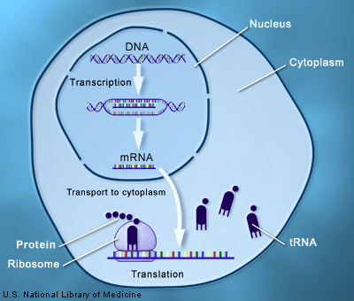
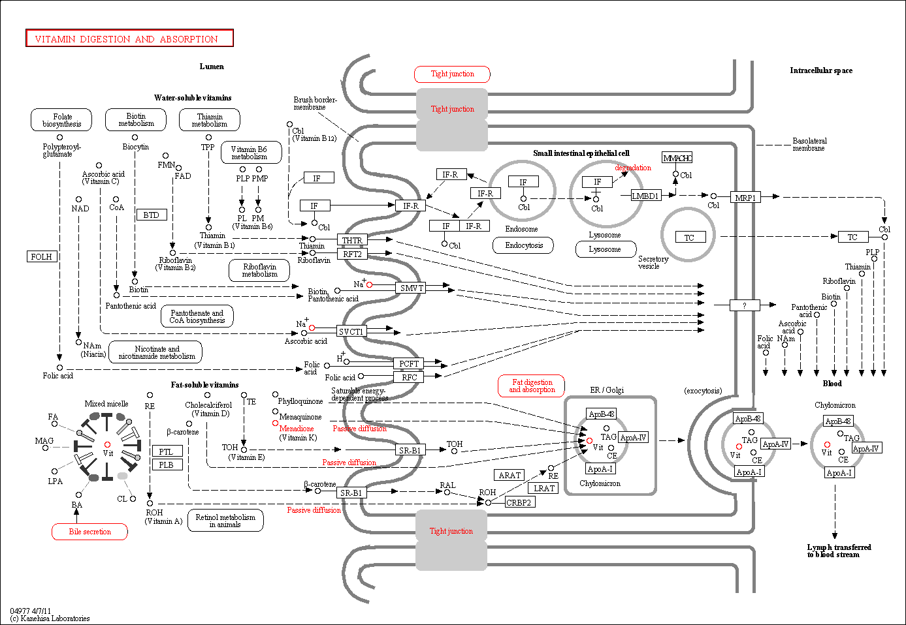

---
title: Introduction to Database
subtitle: 'Nociones Básicas de Bioinformática y Genómica  \newline _(Máster en Bioinformática, Universidad de Valencia)_'
author: '[David Montaner](http://www.dmontaner.com)'
date: 2015-02-16
footer-left: 'Nociones Básicas de Bioinformática y Genómica'
footer-right: Introduction to Databases
...

Bioinformatics & Genomics
================================================================================

\centering

DNA $\rightarrow$ RNA $\rightarrow$ Protein $\rightarrow$ Biological Function

Why genomics Genomics
================================================================================

-   DNA, RNA are interesting on their own.
-   Proteins are the interesting functional features.
-   DNA, RNA are measurable using __high throughput technologies__ such as DNA microarrays and NGS.
-   Protein changes can be _inferred_ form DNA measurements.
-   Protein levels can be _inferred_ form RNA measurements.

List of biological databases (Wikipedia) I
================================================================================

1. __Primary nucleotide sequence databases__
2. __Metadatabases__
3. __Genome databases__
4. __Protein sequence databases__
5. Proteomics databases
6. Protein structure databases
7. Protein model databases
8. __RNA databases__
9. Carbohydrate structure databases
10. __Molecular interactions__ (protein-protein )

List of biological databases (Wikipedia) II
================================================================================

11. Signal transduction pathway databases
2. __Metabolic pathway databases__
3. __Experimental data repositories__ (Microarrays NGS, Sanger)
4. Exosomal databases
5. Mathematical model databases
6. PCR / real time PCR primer databases
7. __Specialized databases__
1. Phenotype databases
8. Taxonomic databases
9. Wiki-style databases
1. Metabolomic Databases

\  

[en.wikipedia.org/wiki/List_of_biological_databases](http://en.wikipedia.org/wiki/List_of_biological_databases)

Primary nucleotide sequence databases
================================================================================

Contain any kind of nucleotide sequences, form genes to genomes.

The International Nucleotide Sequence Database
([INSD](http://www.insdc.org/)) Collaboration:

- GenBank  
  National Center for Biotechnology Information (NCBI)
- European Nucleotide Archive (ENA)  
  European Bioinformatics Institute (EBI)
- DNA Data Bank of Japan (DDBJ)

Primary nucleotide sequence databases: GenBank
================================================================================

- available on the NCBI ftp site: <http://www.ncbi.nlm.nih.gov/Ftp/>
- A new release is made every two months.
- 3 types of entries:
    + CoreNucleotide (the main collection)
    + dbEST (Expressed Sequence Tags)
    + dbGSS (Genome Survey Sequences)

__Access:__

- Search for sequence identifiers using Entrez Nucleotide:
  <http://www.ncbi.nlm.nih.gov/nucleotide/>
- Align GenBank sequences to a query sequence using BLAST (Basic Local Alignment Search Tool): 
  <http://blast.ncbi.nlm.nih.gov/Blast.cgi>
- Several other e-utilities (see [book](http://www.ncbi.nlm.nih.gov/books/NBK25500/))

[See an example of a GenBank record.](http://www.ncbi.nlm.nih.gov/Sitemap/samplerecord)

Metadatabases
================================================================================

- Collect and organize data from _primary nucleotide sequence databases_ and may other resources.
- Make the information available in a convenient format and provide data handling resources: web pages, application programming interface (API) ...
- Focus on particular species, diseases ...

__Examples__

- Entrez: searches through almost all NCBI resources <http://www.ncbi.nlm.nih.gov/sites/gquery>  
  Queries can be saved if you have a a MyNCBI account <http://www.ncbi.nlm.nih.gov/>.
- GeneCards: provides genomic, proteomic, transcriptomic, genetic and
  functional information for human genes (known and _predicted_)
  <http://www.genecards.org/>

Genome databases
================================================================================

Collect genome sequences and _annotation_ (specification about genes)
for particular organisms, and try to improve them:

- Data _curation_.
- Complete missing information using _insilico_ methods.
- Generate new relational organization.
- Complement feature IDs.
- Provide “easy” access, visualization ...

__Examples__

- Ensembl: automatic annotation on selected eukaryote genomes.
- UCSC Genome Browser: reference sequence and working draft assemblies for a large collection of genomes
- Wormbase: genome of the model organism C.elegans.

Genome databases: Ensembl
================================================================================

- Ensembl is a joint project between European Bioinformatics Institute
  (EBI) the European Molecular Biology Laboratory (EMBL) and the
  Wellcome Trust Sanger Institute.
- Develop a software system which produces and maintains automatic
  annotation on selected vertebrate and __eukaryote__ genomes.
- <http://www.ensembl.org>

Genome databases: UCSC Genome Browser
================================================================================

- UCSC: University of California, Santa Cruz.
- This site contains the reference sequence and working draft assemblies for a large collection of genomes.
- <http://genome.ucsc.edu/>
- Complements / formats NCBI 

Protein sequence databases
================================================================================

- Most times proteins are the final unit of interest to research.
- There is a direct conversion from DNA/RNA sequences to protein sequences.
- Gene IDs and protein IDs are equivalently used by researchers
  _(biologists not bioinformaticians)_

__Examples__

- UniProt: Universal Protein Resource (EBI)
- Swiss-Prot (Swiss Institute of Bioinformatics)
- InterPro Classifies proteins into _families_ and predicts the presence of domains and sites.
- Pfam Protein _families_ database of alignments and HMMs (Sanger Institute)

RNA databases
================================================================================

- Contain information about RNA molecules.
- Most of them regarding gene _regulatory factors_. (Gene information is usually in other repositories).

__Examples__

- Ensembl 
- mirBase: microRNAs <http://www.mirbase.org/>
- TRANSFAC: transcription factors in eukaryote (Proprietary database).
- JASPAR: transcription factor binding sites for eukaryote (Open access, curated, non-redundant). <http://jaspar.genereg.net/>

Protein-protein interactions
================================================================================

- Proteins are the main functional units.
- But they do not work in isolation.
- _Pretty useless at the moment but promising in the future ..._ 
- some information is _experimental_, but most of it is generated _insilico_.

__Examples__

- IntAct: protein–small molecule and protein–nucleic acid interactions.
- BIND: Biomolecular Interaction Network Database.

Signal transduction pathway databases & Metabolic pathway databases
================================================================================

- Information about how genes (or proteins) interact among them.
- not only physical interactions ...

__Examples__

- Reactome: free online database of biological pathways. <http://www.reactome.org>

- KEGG: Kyoto Encyclopedia of Genes and Genomes. Metabolic pathways. <http://www.genome.jp/kegg/pathway.html>

KEGG: Metabolic pathway databases
================================================================================

Experimental data repositories
================================================================================

Contain Microarray, NGS, Sanger, and other _experimental_ high throughput data.

- GEO: Gene Expression Omnibus (NCBI) <http://www.ncbi.nlm.nih.gov/geo/>
- ArrayExpress: database of functional genomics experiments including (EBI) <http://www.ebi.ac.uk/arrayexpress/>
- The Cancer Genome Atlas (TCGA): Data on different cancer related tissues. <http://cancergenome.nih.gov/>

Specialized databases
================================================================================

- Gene Ontology (GO): standardizes the representation of gene and gene product attributes. <http://www.geneontology.org/>
- OMIM (Online Mendelian Inheritance in Man): Inherited Diseases <http://www.ncbi.nlm.nih.gov/omim>
- dbSNP: variations in any species and from any part of a genome. <http://www.ncbi.nlm.nih.gov/projects/SNP/>

Taxonomic databases
================================================================================

The most standard reference at the NCBI

- <http://www.ncbi.nlm.nih.gov/taxonomy>

Some other taxonomic information in customized databases: 

<http://www.arb-silva.de/>

Wiki-style databases
================================================================================

- <http://www.snpedia.com/index.php/SNPedia>

Homework
================================================================================

- Quickly explore all the databases of a given category
- See what can be downloaded via FTP or similar
- Spot any interesting tool or related API

\  

Due date:  ~~ 20 Apr.
