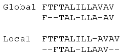
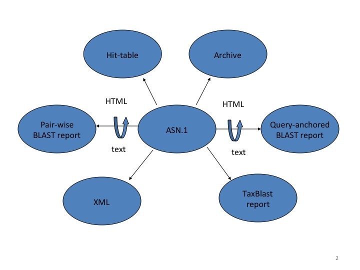

---
title: Sequence alignment: BLAST
subtitle: 'Nociones Básicas de Bioinformática y Genómica  \newline _(Máster en Bioinformática, Universidad de Valencia)_'
author: '[David Montaner](http://www.dmontaner.com)'
date: 2015-04-20
footer-left: 'Nociones Básicas de Bioinformática y Genómica'
footer-right: ENSEMBL
...

[NCBI Handbook: The BLAST Sequence Analysis Tool]: http://www.ncbi.nlm.nih.gov/books/NBK153387
[Wikipedia: Sequence alignment]: http://en.wikipedia.org/wiki/Sequence_alignment

BLAST
================================================================================

__BLAST__: Basic _Local Alignment_ Search Tool

\ 

- _pairwise_ alignment
- _local_ alignment
  (not equal size assumed for the sequences)

BLAST concepts
================================================================================

Alignment of pairs of sequences:

- __query__: our __input__ nucleotide or protein sequences.

- __database__: the __reference__ database of sequences.

\ 

We _blast a query to a database_

Local vs. Global alignment
================================================================================

From [Wikipedia: Sequence alignment]

<!-- 
\raggedleft{\tiny{\href{http://en.wikipedia.org/wiki/Sequence_alignment}{Wikipedia: Sequence alignment}}}
-->

BLAST variations
================================================================================

There are many different variations of BLAST available:

- __DNA__ query to a __DNA__ database: _blastn_
- __protein__ query to a __protein__ database: _blastp_
- __DNA__ query (translated in all six reading frames) to a __protein__ sequence database: _tblastx_ 

Many other variants 

- PSI-BLAST: iterative protein sequence similarity searches
- RPS-BLAST: for protein domains
- MegaBLAST: optimized for nucleotide sequences which aligning almost perfectly

BLAST Scores and Statistics
================================================================================

Generally in an alignment we want to know: 

- general description.
- how good is the alignment.
- how likely is it to happen just by random chance.

Main output parameters
----------------------

- __E-value__: indication of the statistical significance
	- the lower thee better
	- dependent of the database size
- __bit score__: indication of how good the alignment is
    - the higher the better
	- is normalized: different alignments can be compared

BLAST output information
================================================================================

- query id
- subject ids
- % identity
- alignment length
- number of mismatches
- gaps
- query start
- query end
- sequence start
- sequence end
- __E-value__
- __bit score__

BLAST output formats
================================================================================

- Traditional Report: text or HTML with hyperlinks. 
	- devised for human readability
	- not structured
- Hit Table: tabular text file
	- not all information is contained in it
	- easy to read in computers
    - not structured
- XML:
    - structured
	- good to be generally parsed (see <http://biopython.org/>)
	- contains the alignment
- ASN.1:
    - structured
	- to be internally used at the NCBI (see [NCBI toolkit](http://www.ncbi.nlm.nih.gov/IEB/ToolBox/CPP_DOC/))
	- does contains the alignment

BLAST output formats
================================================================================

<!-- 
From the [NCBI Handbook: The BLAST Sequence Analysis Tool]
-->

Practical
================================================================================

<http://blast.ncbi.nlm.nih.gov/Blast.cgi>

<!-- 

http://www.uniprot.org/uniprot/P60484

>prot0
MTAIIKEIVS RNKRRYQEDG FDLDLTYIYP NIIAMGFPAE RLEGVYRNNI DDVVRFLDSK 
HKNHYKIYNL CAERHYDTAK FNCRVAQYPF EDHNPPQLEL IKPFCEDLDQ WLSEDDNHVA 
AIHCKAGKGR TGVMICAYLL HRGKFLKAQE ALDFYGEVRT RDKKGVTIPS QRRYVYYYSY 
LLKNHLDYRP VALLFHKMMF ETIPMFSGGT CNPQFVVCQL KVKIYSSNSG PTRREDKFMY 
FEFPQPLPVC GDIKVEFFHK QNKMLKKDKM FHFWVNTFFI PGPEETSEKV ENGSLCDQEI 
DSICSIERAD NDKEYLVLTL TKNDLDKANK DKANRYFSPN FKVKLYFTKT VEEPSNPEAS 
SSTSVTPDVS DNEPDHYRYS DTTDSDPENE PFDEDQHTQI TKV 
>prot1
MTAIIKEIVS RNKRRYQEDG FDLDLTYIYP NIIAMGFPAE RLEGVYRNNI DDVVRFLDSK 
HKNHYKIYNL CAERHYDTAK FNCRVAQYPF EDHNPPQLEL IKPFCEDLDQ WLSEDDNHVA 
LLKNHLDYRP VALLFHKMMF ETIPMFSGGT CNPQFVVCQL KVKIYSSNSG PTRREDKFMY 
FEFPQPLPVC GDIKVEFFHK QNKMLKKDKM FHFWVNTFFI PGPEETSEKV ENGSLCDQEI 
DSICSIERAD NDKEYLVLTL TKNDLDKANK DKANRYFSPN FKVKLYFTKT VEEPSNPEAS 
SSTSVTPDVS DNEPDHYRYS DTTDSDPENE PFDEDQHTQI TKV 
>prot2
HKNHYKIYNL CAERHYDTAK FNCRVAQYPF EDHNPPQLEL IKPFCEDLDQ WLSEDDNHVA 
AIHCKAGKGR TGVMICAYLL HRGKFLKAQE ALDFYGEVRT RDKKGVTIPS QRRYVYYYSY 
LLKNHLDYRP VALLFHKMMF ETIPMFSGGT CNPQFVVCQL KVKIYSSNSG PTRREDKFMY 
FEFPQPLPVC GDIKVEFFHK QNKMLKKDKM FHFWVNTFFI PGPEETSEKV ENGSLCDQEI 
DSICSIERAD NDKEYLVLTL TKNDLDKANK DKANRYFSPN FKVKLYFTKT VEEPSNPEAS 
SSTSVTPDVS DNEPDHYRYS DTTDSDPENE PFDEDQHTQI TKV 
>prot3
MTAIIKEIVS RNKRRYQEDG FDLDLTYIYP NIIAMGFPAE RLEGVYRNNI DDVVRFLDSK 
HKNHYKIYNL CAERHYDTAK FNCRVAQYPF EDHNPPQLEL IKPFCEDLDQ WLSEDDNHVA 
AIHCKAGKGR TGVMICAYLL HRGKFLKAQE ALDFYGEVRT RDKKGVTIPS QRRYVYYYSY 
LLKNHLDYRP VALLFHKMMF ETIPMFSGGT CNPQFVVCQL KVKIYSSNSG PTRREDKFMY 
FEFPQPLPVC GDIKVEFFHK QNKMLKKDKM FHFWVNTFFI PGPEETSEKV ENGSLCDQEI 
>prot4
MTAIIKEIVS RNKRRYQEDG FDLDLTYIYP NIIAMGFPAE RLEGVYRNNI DDVVRFLDSK 

AIHCKAGKGR TGVMICAYLL HRGKFLKAQE ALDFYGEVRT RDKKGVTIPS QRRYVYYYSY 

FEFPQPLPVC GDIKVEFFHK QNKMLKKDKM FHFWVNTFFI PGPEETSEKV ENGSLCDQEI 

SSTSVTPDVS DNEPDHYRYS DTTDSDPENE PFDEDQHTQI TKV 

-->

References
================================================================================

- [NCBI Handbook: The BLAST Sequence Analysis Tool]
- [Wikipedia: Sequence alignment]

\ 

__Further reading:__

- [NCBI BlastDocs](http://blast.ncbi.nlm.nih.gov/Blast.cgi?CMD=Web&PAGE_TYPE=BlastDocs)
