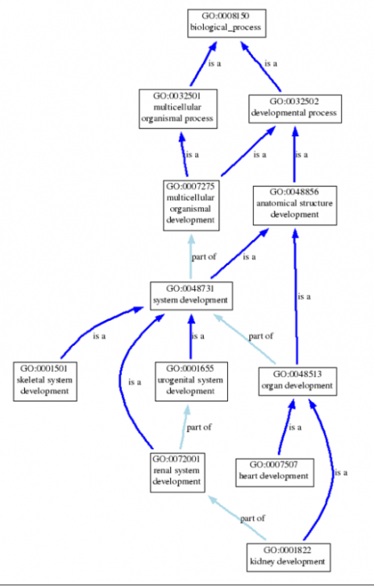
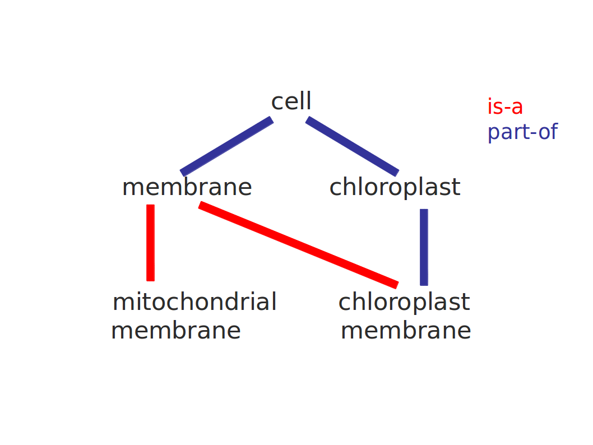

---
title: Gene Ontology
subtitle: 'Nociones Básicas de Bioinformática y Genómica  \newline _(Máster en Bioinformática, Universidad de Valencia)_'
author: '[David Montaner](http://www.dmontaner.com)'
date: 2015-05-18
footer-left: 'Nociones Básicas de Bioinformática y Genómica'
footer-right: Gene Ontology
...

Ontology in Computer Sciences
================================================================================

Ontology: a __model__ for describing the world.  

\ 

Represents _knowledge_ as a _hierarchy_ of _concepts_ within a _domain_.

\ 

Describes a shared vocabulary to denote:

- types of concepts
- properties of the concepts
- interrelationships of the concepts

\ 

See [Wikipedia article](http://en.wikipedia.org/wiki/Ontology_(information_science))
for further descriptions, and observe that ...

_There is also generally an expectation that the features of the 
model in an ontology should closely resemble the real world._

Gene Ontology
================================================================================

Started in 1998 for:

- Drosophila melanogaster
- Mus musculus
- Saccharomyces cerevisiae. 

\ 

Aims to standardize the representation of gene and gene product attributes:

- Develop a controlled vocabulary of gene and gene product attributes.
- Annotate genes and gene products.
- Tools.

\ 

Cite: [Ashburner M, et al. (May 2000) Nat. Genet](http://www.ncbi.nlm.nih.gov/pmc/articles/PMC3037419/)

Gene Ontology
================================================================================

The ontology covers three domains^[formally there are tree ontologies]:

- __cellular component__: parts of a cell or extra cellular environment.
- __molecular function__: activity of genes or gene products at molecular level.
- __biological process__: process of a living organism accomplished by one or more molecular functions (different levels: cells, tissues, organs...)

Structure: directed acyclic graph (DAG)
================================================================================

Gene Ontology Relationships
================================================================================

Relationships between terms of the ontology: 

- is a
- is part of
- regulates

\ 

See a complete explanation of the [GO relations here.](http://www.geneontology.org/GO.ontology.relations.shtml)

Gene Ontology Relationships
================================================================================

Undirected graph
================================================================================

Cyclic graph _(with cycles)_
================================================================================

DAG
================================================================================

Gene Annotation
================================================================================

When genes are annotated to a GO term 
an _Evidence Code_ is assigned to the _membership relationship_:

- Experimental Evidence Codes
- Computational Analysis Evidence Codes
- Author Statement Evidence Codes
- Curator Statement Evidence Codes
- Automatically-assigned Evidence Codes
- Obsolete Evidence Codes

See full evidence code description here:  
<http://www.geneontology.org/GO.evidence.shtml>

Some Remarks
================================================================================

- Gene Ontology terms are defined _a priori_ to gene membership.
- A gene may be annotated under many GO terms.
- A gene _inherits_ all _parent_ annotations
- Genes may belong to GO terms _via_ many different _evidences_
- Just normal (sane) functions are described. Functions which are unique to mutants or diseases are not (e.g. oncogenesis)
- The GO vocabulary is designed to be species-neutral and applicable to prokaryotes, eukaryotes, single and multicellular organisms.

\ 

- Gene - GO association data may be downloaded straight from the GO consortium...
- but usually is easier to get that information from the different _genomic projects pages_ or form Ensembl or other collection webs

Links
================================================================================

- [Gene Ontology Consortium](http://www.geneontology.org/): web of the consortium
- [GO documentation](http://www.geneontology.org/GO.doc.shtml): An Introduction to the Gene Ontology
- [GO data](http://www.geneontology.org/GO.doc.shtml): An Introduction to the Gene Ontology
- _Official_ search tool: <http://amigo.geneontology.org> query, browse and visualize ontologies and gene product annotation data.

<!-- NOTES

The Gene Ontology (GO) project is a collaborative effort to address the need for consistent descriptions of gene products in different databases

homogeneous vocabulary

collaboration __between__ three model organism databases,

The GO project has developed three structured controlled vocabularies (ontologies)

A biological process is not equivalent to a pathway; at present, GO does not try to represent the dynamics or dependencies

Annotation is the practice of capturing the activities and localization of a gene product with GO terms

-->
